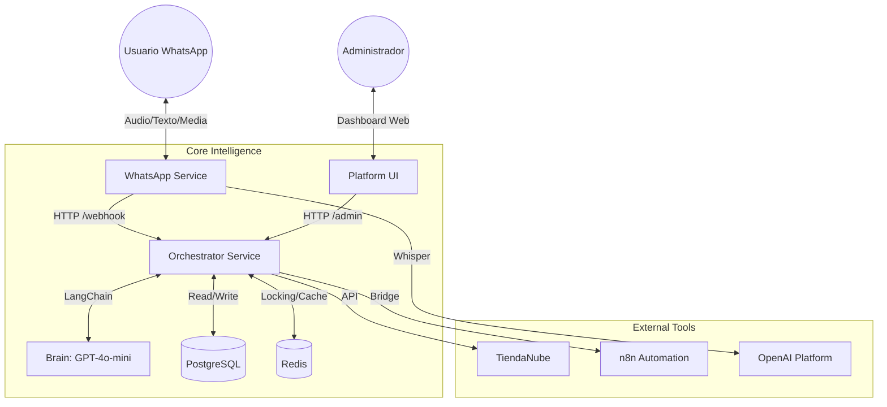

# AGENTS.md: Arquitectura y Guía de Agentes

Este documento centraliza la arquitectura, lógica de negocio e integración de los Agentes de IA en el ecosistema **PointCoach**.

## Visión General del Sistema

El sistema opera bajo una arquitectura de microservicios centralizada en un "Orquestador Inteligente", apoyado por un Dashboard administrativo (`platform-ui`) y servicios satélite de percepción y ejecución.

### Diagrama de Arquitectura Lógica

## Componentes del Sistema

### 1. Platform UI (Escritorio de Control)
*   **Rol:** Interfaz visual para la administración de tenancies, configuración y **Human-in-the-Loop**.
*   **Stack:** Vanilla JS (HTML5, CSS3, ES6+).
*   **Funciones Clave:**
    *   **Gestión de Tenants:** Alta de nuevas tiendas con números de teléfono únicos.
    *   **Chat View (HITL):** Visualización en tiempo real de conversaciones, estados de bloqueo IA, y envío manual de mensajes.
    *   **Gestión de Credenciales:** Sistema centralizado para configurar API Keys (YCloud, Meta, OpenAI).

### 2. Orchestrator Service (El Cerebro)
*   **Rol:** Núcleo de decisión y API administrativa.
*   **Stack:** Python 3.11, FastAPI, LangChain.
*   **Novedades v2.0 (HITL):**
    *   **Control de Flujo:** Gestiona la lógica de bloqueo de IA (`human_override`).
    *   **Persistencia Centralizada:** Almacena todos los mensajes (User, AI, Human) en `chat_messages`.
    *   **Endpoints Administrativos:** Provee APIs para listar chats, historial completo y envío manual.
    *   **Ingesta de Media:** Procesa y almacena metadatos de imágenes, audios y documentos.

### 3. WhatsApp Service (Percepción y Entrega)
*   **Rol:** Pasarela de comunicación con YCloud/Meta.
*   **Stack:** Python, FastAPI.
*   **Capacidades:**
    *   **Manejo de Media:** Extrae metadatos de imágenes/docs y los envía INMEDIATAMENTE al orquestador.
    *   **Detección de Echoes:** Identifica mensajes enviados desde el celular físico (WhatsApp App) y los remite como "Human Messages" para activar el bloqueo de IA.
    *   **Transcrpción de Audio:** Usa Whisper para notas de voz.
    *   **Buffering de Texto:** Agrupa mensajes de texto cortos (ventana de 2s) para mejorar el contexto de la IA.

## Human-in-the-Loop (HITL) Architecture

El sistema implementa un modelo estricto de intervención humana. La IA está subordinada a la acción humana.

### 1. Modelo de Datos (`chat_conversations` & `chat_messages`)

La "verdad" del sistema reside en PostgreSQL, tabla `chat_messages`.

**Tabla `chat_conversations`:**
*   `status`: `open`, `human_override`, `closed`, `archived`.
*   `human_override_until`: TIMESTAMP. Si `NOW() < human_override_until`, la IA **NO** responde.
*   `last_message_at`: Para ordenamiento.

**Tabla `chat_messages`:**
*   `role`: `user`, `assistant`, `human_supervisor`, `system`.
*   `message_type`: `text`, `image`, `audio`, `document`.
*   `human_override`: BOOLEAN. Indica si el mensaje forzó el bloqueo de la IA.
*   `media_id`: Link a la tabla `chat_media` con URLs de almacenamiento.

### 2. Lógica de Bloqueo (AI Lockout)

La IA se bloquea automáticamente por 24 horas (`human_override_until = NOW() + 24h`) cuando:
1.  Un humano envía un mensaje desde el **Platform UI** (`/admin/messages/send`).
2.  Un humano envía un mensaje desde la **App de WhatsApp** (detectado como evento `echo`).

Durante el bloqueo:
*   El Orquestador recibe los mensajes del usuario.
*   Los persiste en la DB.
*   **NO** invoca a LangChain/OpenAI.
*   Retorna status `ignored` (Conversation locked).

### 3. Manejo de Media

*   **Ingesta:** WhatsApp Service extrae URLs y MimeTypes.
*   **Almacenamiento:** Orquestador guarda en `chat_media`.
*   **Visualización:** Platform UI renderiza burbujas multimedia (Imagen, Audio Player, Link Documento).

## API Endpoints (Admin)

### Chat Management
*   `GET /admin/chats`: Lista conversaciones activas con estado de bloqueo y previews.
*   `GET /admin/chats/{id}/messages`: Historial cronológico completo enriquecido con media.

### Messaging
*   `POST /admin/messages/send`:
    *   Payload: `{ conversation_id, text, human_override: true }`
    *   Efecto: Envía mensaje a WhatsApp, persiste como `human_supervisor`, activa bloqueo IA.

### Credentials & Config
*   `GET /admin/credentials`: Lista credenciales (masked).
*   `POST /admin/credentials`: Crea o actualiza credenciales (atomic upsert).

## Lógica de Agente y Reglas de Negocio

El Prompt del Sistema (`system_prompt_template`) define reglas críticas que **todo modelo debe respetar**:

### 1. Protocolo de Respuesta (Burbujas)
Para presentar productos, el agente DEBE seguir una secuencia estricta de 8 pasos ("burbujas") para maximizar la conversión.

### 2. Estrategia de Herramientas (Hybrid Tools)
*   **Search (Directa):** `search_specific_products` (consultas específicas).
*   **General (Fallback):** `browse_general_storefront` (exploración).

## Guía para Desarrolladores

1.  **Regla de Oro (Conectividad):** Nunca toques el orden de los middlewares en `main.py`. CORS va primero.
2.  **Migraciones:** Usa SQL *idempotente* (con `IF NOT EXISTS`) dentro de `lifespan` en `main.py`.
3.  **UI Updates:** Si cambias la API, actualiza `platform_ui/app.js` correspondientemente.
4.  **HITL Integrity:** Nunca bypasses el check `human_override` en el endpoint `/chat`. La confianza del usuario depende de que el bot se calle cuando se le ordena.
