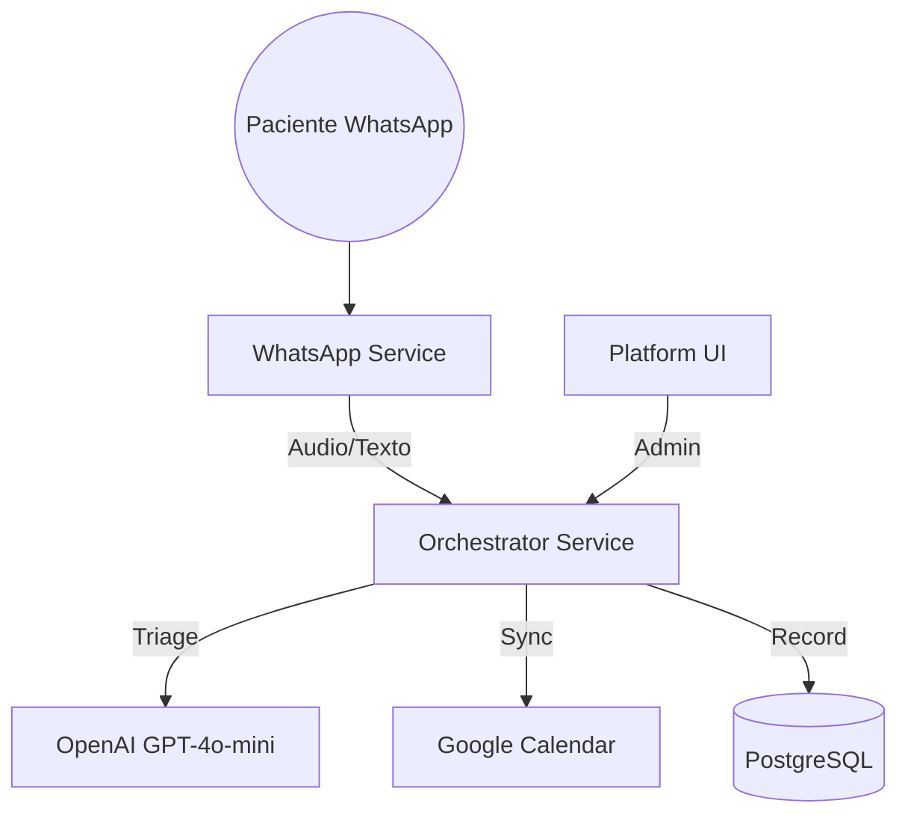

# 🦷 Dentalogic - Plataforma de Gestión Clínica con IA

Sistema de coordinación clínica inteligente, impulsado por IA (**LangChain + OpenAI GPT-4o-mini**). El sistema actúa como un coordinador clínico que gestiona turnos, realiza triajes de urgencias y mantiene historias clínicas digitales **multi-tenant** (multi-sede). Pensado tanto para **una clínica** como para **empresarios o grupos con varias sedes**, con un único panel de control, datos aislados por sede y soporte multiidioma en toda la interfaz.

---

## ¿Para quién es esta plataforma?

- **Clínicas dentales (una o varias sedes):** Centralizan agenda, pacientes, conversaciones por WhatsApp y analíticas en una sola herramienta.
- **Empresarios con múltiples clínicas:** Cada sede (tenant) tiene sus propios datos, calendarios y configuraciones; el CEO puede cambiar de sede, ver analíticas por profesional y gestionar personal y sedes desde un único acceso.
- **Equipos multilingües:** La interfaz de la plataforma está disponible en **Español**, **Inglés** y **Francés**. El idioma se elige en Configuración y se aplica a toda la UI (menús, formularios, mensajes, agenda, analíticas, etc.). El asistente por WhatsApp detecta el idioma del paciente y responde en el mismo idioma.

---

## Funcionalidades principales (qué hace la plataforma)

| Módulo | Descripción |
| :--- | :--- |
| **Dashboard** | Vista general: urgencias recientes, conversaciones IA, turnos del día, ingresos; métricas en tiempo real y panel soberano para CEO. |
| **Agenda** | Vista semanal, mensual y día; **filtro por profesional** en semanal/mensual (CEO y secretaria); **profesionales solo ven su propio calendario** (una columna en vista día). Turnos por profesional; colores por origen (IA, manual, Google Calendar); creación/edición de turnos; sincronización híbrida (local o Google Calendar por sede); actualización en tiempo real vía Socket.IO. |
| **Pacientes** | Listado, búsqueda, ficha clínica digital; historial de evoluciones, anamnesis, antecedentes; alta y edición de pacientes; primer turno opcional al crear. |
| **Conversaciones (Chats)** | Chats por sede; historial de mensajes con la IA; handoff a humano y silencio 24h; contexto clínico y próximo turno; activar/desactivar IA por conversación. |
| **Analíticas (CEO)** | Métricas por profesional: turnos, tasa de realización, retención, ingresos estimados; comparativa entre profesionales; filtros por rango de fechas y profesionales. |
| **Personal y aprobaciones (CEO)** | Solicitudes de registro (por sede, rol, especialidad); aprobar/rechazar; personal activo; vincular a sedes; editar perfil y horarios desde el mismo flujo. |
| **Sedes (Clinics)** | Gestión de ubicaciones/sedes (multi-tenant); cada sede tiene su configuración, calendario y datos aislados. |
| **Tratamientos** | CRUD de servicios/tratamientos con precios, duraciones y categorías; configuración de complejidad y gaps entre sesiones. |
| **Perfil** | Datos del usuario; configuración de Google Calendar para sincronizar agenda. |
| **Configuración (CEO)** | **Selector de idioma de la plataforma** (Español / English / Français). El valor se guarda por sede y aplica a **toda** la interfaz: login, menús, formularios, agenda, analíticas, chats, etc. |
| **Landing / Demo pública** | Página **pública** en `/demo` (sin login): información estratégica, credenciales de prueba y tres acciones: **Probar app** (login automático a cuenta demo), **Probar Agente IA** (WhatsApp con mensaje predefinido) e **Iniciar sesión**. Optimizada para móvil y conversión; única ruta accesible sin autenticación junto con `/login`. |

---

## Flujo del agente de IA (datos que necesita)

El asistente por WhatsApp sigue un **flujo de conversación definido** para consultas, disponibilidad y agendamiento. Estos son los datos que el agente necesita y el orden en que debe usarlos:

1. **Saludo e identidad**  
   En el primer mensaje de cada conversación, el agente se presenta y **menciona la clínica** para la cual trabaja (ej.: *"Hola, soy la asistente de [Nombre Clínica], es un gusto saludarte."*).

2. **Definir siempre un servicio**  
   Antes de consultar disponibilidad o agendar, debe quedar claro **qué tratamiento o tipo de consulta** necesita el paciente (limpieza, revisión, urgencia, etc.).  
   - El agente puede **mencionar o sugerir** en base a la consulta; **no** debe listar todos los servicios.  
   - Si en algún momento lista opciones, **máximo 3** y solo las más relevantes a lo que preguntó el usuario.

3. **Duración del turno**  
   Con el **servicio elegido**, se usa la **duración configurada** de ese servicio para consultar disponibilidad y para agendar (la herramienta `check_availability` y `book_appointment` usan el nombre del tratamiento y toman la duración desde la base de datos).

4. **Disponibilidad (local o Google Calendar) y profesional**  
   **Antes de agendar**, el agente debe **consultar disponibilidad real** (según cómo esté configurada la sede: agenda **local** o **Google Calendar**).  
   - Para elegir profesional, el agente puede **preguntar** si el usuario tiene preferencia por algún profesional o si busca **cualquiera con disponibilidad**; según la respuesta, consulta con ese profesional o con el primer disponible.  
   - La herramienta `check_availability` puede recibir opcionalmente el nombre del profesional; si no se pasa, devuelve huecos de cualquier profesional activo de la sede.

5. **Agendar solo con todo definido**  
   **Con el servicio, el profesional (si aplica), el día y el horario elegidos**, y los datos del paciente (nombre, apellido, DNI, obra social), el agente ejecuta `book_appointment`. El turno se registra en el **calendario local** o en **Google Calendar** según la configuración de la clínica (y, en Google, en el calendario del profesional correspondiente).

Resumen: **consulta → saludo/clínica → definir servicio (máx. 3 si se listan) → (opcional) preferencia de profesional → check_availability con duración del servicio → ofrecer horarios → datos del paciente → book_appointment**.

---

## Idiomas e internacionalización

- **Interfaz (UI):** Tres idiomas soportados: **Español (es)**, **Inglés (en)** y **Francés (fr)**. La preferencia se configura en **Configuración** (solo CEO) y se persiste por sede (`tenants.config.ui_language`). Al cambiar el idioma, **toda la plataforma** actualiza al instante (Login, Dashboard, Agenda, Pacientes, Chats, Analíticas, Aprobaciones, Sedes, Tratamientos, Perfil, menús y componentes compartidos).
- **Asistente por WhatsApp:** Responde en el **idioma del mensaje del paciente** (detección automática es/en/fr). No depende del idioma elegido en la UI; cada conversación puede ser en un idioma distinto según lo que escriba el lead.

---

## Número del bot y datos de la clínica

- **Sí: el bot usa el número que carga la clínica.** Cada sede (tenant) tiene en la base de datos su **número de WhatsApp** (`tenants.bot_phone_number`) y su **nombre** (`tenants.clinic_name`). Cuando llega un mensaje por WhatsApp, el sistema identifica la sede por el número al que el usuario escribió (`to_number`) y usa ese tenant para toda la conversación (turnos, pacientes, idioma, calendario). Esos datos se configuran en **Sedes (Clinics)** en el panel.
- **Variables de entorno** como `BOT_PHONE_NUMBER` y `CLINIC_NAME` actúan como **respaldo** cuando no viene número en la petición (por ejemplo en pruebas manuales) o cuando la sede no tiene nombre cargado. En producción multi-sede, la fuente de verdad es la base de datos por sede. Ver `docs/02_environment_variables.md` para el detalle.

---

## Multi-sede (multi-tenant)

- **Aislamiento de datos:** Pacientes, turnos, chats, profesionales y configuraciones están separados por `tenant_id` (sede). Una sede no ve datos de otra.
- **CEO:** Puede cambiar de sede en Chats y en otras vistas; gestiona aprobaciones, sedes y configuración por sede.
- **Secretarias y profesionales:** Acceden solo a la(s) sede(s) asignadas.
- **Calendario:** Cada sede puede usar agenda local o Google Calendar; la configuración y los turnos son por sede.

---

## 🚀 Guía Rápida de Inicio

### 1. Configuración Inicial
```bash
# Sincronizar entorno dental
cp dental.env.example .env

# Completar las variables (Ver docs/02_environment_variables.md):
# - OPENAI_API_KEY
# - YCLOUD_API_KEY / YCLOUD_WEBHOOK_SECRET  
# - POSTGRES_DSN / REDIS_URL
# - CLINIC_NAME, BOT_PHONE_NUMBER
# - GOOGLE_CALENDAR_ID (Opcional)
```

### 2. Levantar la Infraestructura
```bash
docker-compose up --build
```

### 3. Acceder a los Servicios
| Servicio | URL | Función |
| :--- | :--- | :--- |
| **Orchestrator** | `http://localhost:8000` | Coordinador Clínico (FastAPI + LangChain) |
| **WhatsApp Service** | `http://localhost:8002` | Relay de Mensajería y Whisper |
| **Operations Center** | `http://localhost:5173` | Centro de Operaciones Dental (React); UI en ES/EN/FR según Configuración. |

---

### 📚 Documentación Completa

### ⚙️ [01. Arquitectura de Microservicios](docs/01_architecture.md)
- Estructura de servicios (Backend, Frontend, Database)
- **Smart Availability:** Lógica JIT y limpieza de nombres.

### 🔑 [02. Variables de Entorno](docs/02_environment_variables.md)
- Credenciales de Google Calendar, OpenAI y YCloud.

### ☁️ [03. Guía de Despliegue](docs/03_deployment_guide.md)
- Instrucciones EasyPanel y configuración de Service Accounts.

### 🧠 [04. Lógica del Agente Dental](docs/04_agent_logic_and_persona.md)
- Persona: Asistente Clínico Profesional.
- Tools: `check_availability`, `book_appointment`, `triage_urgency`.

### 🔀 [13. Flujo Lead -> Paciente](docs/13_lead_patient_workflow.md)
- Protocolo de conversión de contactos nuevos a pacientes activos.

### 🔌 [API Reference](docs/API_REFERENCE.md)
- Endpoints administrativos: Tratamientos, Pacientes, Profesionales.

### 📊 [11. Análisis de Gaps](docs/11_gap_analysis_nexus_to_dental.md)
- Estado actual de la implementación vs requerimientos finales.

### 🌐 [25. Idioma plataforma y agente](docs/25_idioma_plataforma_y_agente.spec.md)
- Selector de idioma (ES/EN/FR) en Configuración; alcance en toda la UI; detección de idioma del mensaje para el asistente WhatsApp; i18n completado por vista/componente.

### 🤖 [Contexto para agentes IA](docs/CONTEXTO_AGENTE_IA.md)
- Punto de entrada para que otra IA (en otra conversación) tome contexto completo: stack, estructura, reglas, API, rutas, BD, i18n e índice de documentación.

### 📋 [Prompt completo para IA](docs/PROMPT_CONTEXTO_IA_COMPLETO.md)
- Bloque de texto listo para copiar y pegar al inicio de una conversación con una IA: contexto global, reglas, workflows, skills y cómo trabajar en fixes o cambios correctamente.

---

## 🏗️ Tecnologías Core

| Componente | Tecnología |
| :--- | :--- |
| **Backend** | FastAPI + Python 3.11+ |
| **IA / LLM** | LangChain + GPT-4o-mini + Whisper |
| **Persistencia** | PostgreSQL (Historias Clínicas) |
| **Caché / Locks** | Redis (Deduplicación / Contexto) |
| **Frontend** | React + Tailwind CSS |
| **Infraestructura** | Docker + EasyPanel |

---

## 🎯 Arquitectura Clínica



---

## ⚡ Características Principales

✅ **Coordinador Clínico:** Gestión automatizada de turnos vía WhatsApp.  
✅ **Smart Availability:** Sincronización JIT con Google Calendar y limpieza de nombres.  
✅ **Gestión de Tratamientos:** CRUD administrativo completo con precios y duraciones dinámicas.  
✅ **Triaje Inteligente:** Clasificación de urgencias por IA.  
✅ **Historias Clínicas:** Registro automático de evoluciones y anamnesis.  
✅ **Transcripción Whisper:** Soporte completo para síntomas enviados por audio.  
✅ **Lockout de 24h:** Silencio automático ante intervención humana.  
✅ **Multi-sede (multi-tenant):** Datos y configuración aislados por sede; ideal para grupos con varias clínicas.  
✅ **Interfaz multiidioma (i18n):** Toda la plataforma en Español, Inglés o Francés; selector en Configuración; efecto inmediato en login, menús, agenda, analíticas, chats y resto de vistas.  
✅ **Landing y demo pública:** Página de entrada en `/demo` para leads y campañas: probar la app con login automático, probar el agente por WhatsApp o iniciar sesión; móvil-first y orientada a conversión.

---

## Cómo ayuda a clínicas y empresarios

- **Una sola clínica:** Centralizá agenda, pacientes, WhatsApp con IA y reportes en una herramienta; menos planillas y llamados perdidos.
- **Varias sedes (grupos o franquicias):** Cada sede tiene sus datos y calendario aislados; el CEO ve todas las sedes, aprobaciones de personal y analíticas desde un único panel. Ideal para dueños de 2 o más clínicas que quieren control sin mezclar información entre sedes.
- **Captación de leads:** El agente por WhatsApp atiende consultas, ofrece turnos y deriva a humano cuando hace falta; la landing (`/demo`) permite que un lead pruebe la plataforma en un clic antes de comprometerse.

---

## Estado actual del proyecto

- **Backend:** Orchestrator (FastAPI) con agente LangChain, herramientas de agenda/triaje/derivación, mantenimiento self-healing de BD, API administrativa y configuración por tenant (incl. `ui_language`). Calendario híbrido por sede (local o Google); resolución de tenant por número de bot (con fallback por dígitos); creación de pacientes con manejo de duplicados (409); creación de turnos manual con `appointment_datetime` y `appointment_type`. Formato canónico y reintento ante error en el agente (prompt: FORMATO CANÓNICO AL LLAMAR TOOLS, NUNCA DAR POR PERDIDA UNA RESERVA); mensajes de error de `book_appointment` con "Formato esperado" para guiar reintentos.
- **Frontend:** React + Tailwind; todas las vistas principales y componentes compartidos utilizan el sistema de traducciones (`useTranslation()` + `t('clave')`); selector de idioma en Configuración con persistencia por sede. Modal Nuevo Paciente con alta de turno en el mismo paso; modal Editar perfil del profesional con campo ID Calendario (Google); Tratamientos con icono Edit2 importado. **Landing pública** en `/demo` (LandingView) con CTAs Probar app / Probar Agente IA / Iniciar sesión; **login con demo** en `/login?demo=1` (prellenado y botón "Entrar a la demo"). Clic en notificación de derivación humana abre la conversación derivada (ChatsView usa `location.state.selectPhone`). Página Staff (Aprobaciones) con aislamiento de scroll; contraste de etiquetas en formulario de registro mejorado.
- **Integraciones:** WhatsApp (YCloud), OpenAI (GPT-4o-mini, Whisper), Google Calendar (opcional por sede y por profesional con `google_calendar_id`), PostgreSQL, Redis.
- **Documentación:** Arquitectura, variables de entorno, despliegue, lógica del agente, flujo lead-paciente, API Reference, especificaciones de features (incl. idioma plataforma, calendario híbrido, scroll Staff, landing demo pública) e informes de auditoría en la carpeta `docs/`.

---

## Documentación técnica (backend, frontend, base de datos, flujos)

| Área | Documento | Contenido |
| :--- | :--- | :--- |
| **Arquitectura** | [01_architecture.md](docs/01_architecture.md) | Microservicios, Orchestrator, WhatsApp Service, layout y scroll, multi-tenant. |
| **Variables de entorno** | [02_environment_variables.md](docs/02_environment_variables.md) | OPENAI, YCloud, PostgreSQL, Redis, GOOGLE_CREDENTIALS, CREDENTIALS_FERNET_KEY, etc. |
| **Despliegue** | [03_deployment_guide.md](docs/03_deployment_guide.md) | EasyPanel, Service Accounts, configuración de producción. |
| **Agente IA** | [04_agent_logic_and_persona.md](docs/04_agent_logic_and_persona.md) | Persona, reglas clínicas, tools, flujo de conversación y datos que necesita. |
| **Desarrollo** | [05_developer_notes.md](docs/05_developer_notes.md) | Notas para desarrolladores. |
| **Workflows** | [07_workflow_guide.md](docs/07_workflow_guide.md) | Ciclo de vida de tareas, Git, documentación, checklist pre-commit. |
| **Lead → Paciente** | [13_lead_patient_workflow.md](docs/13_lead_patient_workflow.md) | Protocolo de conversión de contactos a pacientes. |
| **Calendario híbrido** | [26_calendario_hibrido_clinica_profesional.spec.md](docs/26_calendario_hibrido_clinica_profesional.spec.md) | Spec: local vs Google por clínica, `google_calendar_id` por profesional, persistencia y tools. |
| **Auditoría spec 26** | [audit_26_calendario_hibrido_2026-02-10.md](docs/audit_26_calendario_hibrido_2026-02-10.md) | Verificación código vs spec (calendario híbrido). |
| **API** | [API_REFERENCE.md](docs/API_REFERENCE.md) | Endpoints administrativos: pacientes, profesionales, turnos, tratamientos, tenants. |
| **Contexto para IA** | [CONTEXTO_AGENTE_IA.md](docs/CONTEXTO_AGENTE_IA.md) | Punto de entrada para que otra IA tenga contexto del stack, reglas y documentación. |
| **Cambios recientes** | [cambios_recientes_2026-02-10.md](docs/cambios_recientes_2026-02-10.md) | Resumen de implementaciones y correcciones de la sesión 2026-02-10 (spec 26, disponibilidad, paciente+turno, docs). |
| **Landing / Demo pública** | [28_landing_demo_publica.spec.md](docs/28_landing_demo_publica.spec.md) | Spec: página pública `/demo`, login demo `/login?demo=1`, Probar app / Probar Agente IA / Iniciar sesión; móvil y conversión. |
| **Scroll Staff** | [27_staff_scroll_aislamiento.spec.md](docs/27_staff_scroll_aislamiento.spec.md) | Aislamiento de scroll en página Staff (Aprobaciones) para listas largas en desktop y móvil. |
| **Seguridad (OWASP)** | [29_seguridad_owasp_auditoria.spec.md](docs/29_seguridad_owasp_auditoria.spec.md) | Auditoría según OWASP Top 10:2025; redacción de credenciales en UI demo ([REDACTED]); buenas prácticas SQL y auth. |

---

*Sistema Dentalogic © 2026.*
