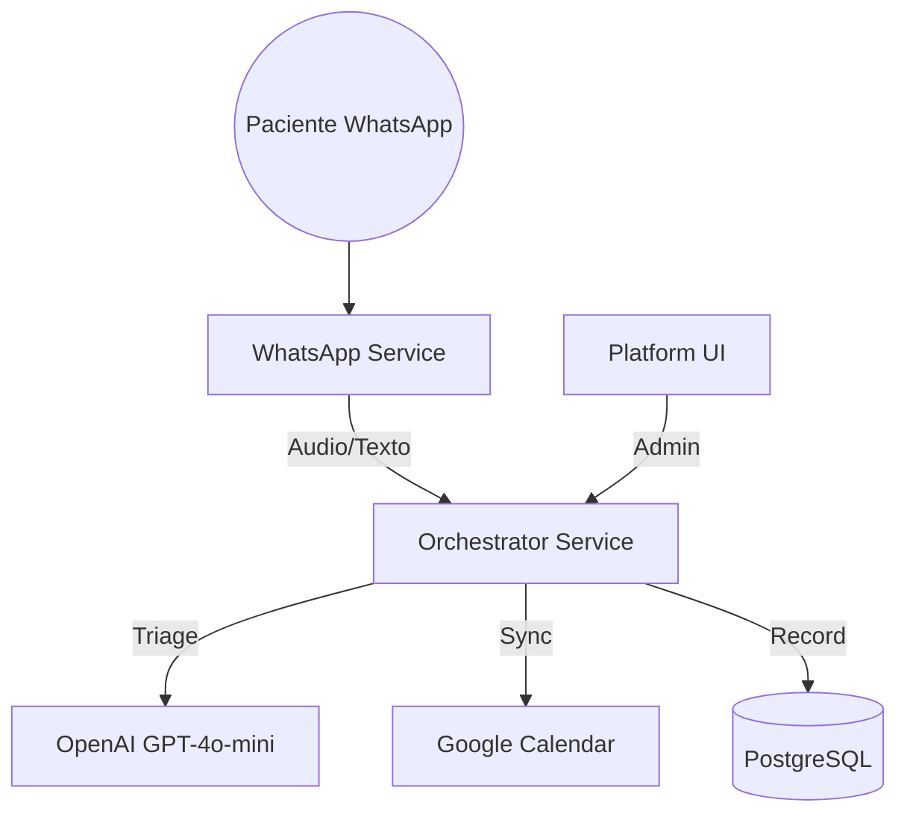

# 🦷 Dentalogic - Plataforma de Gestión Clínica con IA

Sistema de coordinación clínica inteligente, impulsado por IA (**LangChain + OpenAI GPT-4o-mini**). El sistema actúa como un coordinador clínico que gestiona turnos, realiza triajes de urgencias y mantiene historias clínicas digitales **multi-tenant** (multi-sede). Pensado tanto para **una clínica** como para **empresarios o grupos con varias sedes**, con un único panel de control, datos aislados por sede y soporte multiidioma en toda la interfaz.

---

## ¿Para quién es esta plataforma?

- **Clínicas dentales (una o varias sedes):** Centralizan agenda, pacientes, conversaciones por WhatsApp y analíticas en una sola herramienta.
- **Empresarios con múltiples clínicas:** Cada sede (tenant) tiene sus propios datos, calendarios y configuraciones; el CEO puede cambiar de sede, ver analíticas por profesional y gestionar personal y sedes desde un único acceso.
- **Equipos multilingües:** La interfaz de la plataforma está disponible en **Español**, **Inglés** y **Francés**. El idioma se elige en Configuración y se aplica a toda la UI (menús, formularios, mensajes, agenda, analíticas, etc.). El asistente por WhatsApp detecta el idioma del paciente y responde en el mismo idioma.

---

## Funcionalidades principales (qué hace la plataforma)

| Módulo | Descripción |
| :--- | :--- |
| **Dashboard** | Vista general: urgencias recientes, conversaciones IA, turnos del día, ingresos; métricas en tiempo real y panel soberano para CEO. |
| **Agenda** | Vista semanal/mensual/día; turnos por profesional; colores por origen (IA, manual, Google Calendar); creación/edición de turnos; sincronización híbrida (local o Google Calendar por sede). |
| **Pacientes** | Listado, búsqueda, ficha clínica digital; historial de evoluciones, anamnesis, antecedentes; alta y edición de pacientes; primer turno opcional al crear. |
| **Conversaciones (Chats)** | Chats por sede; historial de mensajes con la IA; handoff a humano y silencio 24h; contexto clínico y próximo turno; activar/desactivar IA por conversación. |
| **Analíticas (CEO)** | Métricas por profesional: turnos, tasa de realización, retención, ingresos estimados; comparativa entre profesionales; filtros por rango de fechas y profesionales. |
| **Personal y aprobaciones (CEO)** | Solicitudes de registro (por sede, rol, especialidad); aprobar/rechazar; personal activo; vincular a sedes; editar perfil y horarios desde el mismo flujo. |
| **Sedes (Clinics)** | Gestión de ubicaciones/sedes (multi-tenant); cada sede tiene su configuración, calendario y datos aislados. |
| **Tratamientos** | CRUD de servicios/tratamientos con precios, duraciones y categorías; configuración de complejidad y gaps entre sesiones. |
| **Perfil** | Datos del usuario; configuración de Google Calendar para sincronizar agenda. |
| **Configuración (CEO)** | **Selector de idioma de la plataforma** (Español / English / Français). El valor se guarda por sede y aplica a **toda** la interfaz: login, menús, formularios, agenda, analíticas, chats, etc. |

---

## Idiomas e internacionalización

- **Interfaz (UI):** Tres idiomas soportados: **Español (es)**, **Inglés (en)** y **Francés (fr)**. La preferencia se configura en **Configuración** (solo CEO) y se persiste por sede (`tenants.config.ui_language`). Al cambiar el idioma, **toda la plataforma** actualiza al instante (Login, Dashboard, Agenda, Pacientes, Chats, Analíticas, Aprobaciones, Sedes, Tratamientos, Perfil, menús y componentes compartidos).
- **Asistente por WhatsApp:** Responde en el **idioma del mensaje del paciente** (detección automática es/en/fr). No depende del idioma elegido en la UI; cada conversación puede ser en un idioma distinto según lo que escriba el lead.

---

## Multi-sede (multi-tenant)

- **Aislamiento de datos:** Pacientes, turnos, chats, profesionales y configuraciones están separados por `tenant_id` (sede). Una sede no ve datos de otra.
- **CEO:** Puede cambiar de sede en Chats y en otras vistas; gestiona aprobaciones, sedes y configuración por sede.
- **Secretarias y profesionales:** Acceden solo a la(s) sede(s) asignadas.
- **Calendario:** Cada sede puede usar agenda local o Google Calendar; la configuración y los turnos son por sede.

---

## 🚀 Guía Rápida de Inicio

### 1. Configuración Inicial
```bash
# Sincronizar entorno dental
cp dental.env.example .env

# Completar las variables (Ver docs/02_environment_variables.md):
# - OPENAI_API_KEY
# - YCLOUD_API_KEY / YCLOUD_WEBHOOK_SECRET  
# - POSTGRES_DSN / REDIS_URL
# - CLINIC_NAME, BOT_PHONE_NUMBER
# - GOOGLE_CALENDAR_ID (Opcional)
```

### 2. Levantar la Infraestructura
```bash
docker-compose up --build
```

### 3. Acceder a los Servicios
| Servicio | URL | Función |
| :--- | :--- | :--- |
| **Orchestrator** | `http://localhost:8000` | Coordinador Clínico (FastAPI + LangChain) |
| **WhatsApp Service** | `http://localhost:8002` | Relay de Mensajería y Whisper |
| **Operations Center** | `http://localhost:5173` | Centro de Operaciones Dental (React); UI en ES/EN/FR según Configuración. |

---

### 📚 Documentación Completa

### ⚙️ [01. Arquitectura de Microservicios](docs/01_architecture.md)
- Estructura de servicios (Backend, Frontend, Database)
- **Smart Availability:** Lógica JIT y limpieza de nombres.

### 🔑 [02. Variables de Entorno](docs/02_environment_variables.md)
- Credenciales de Google Calendar, OpenAI y YCloud.

### ☁️ [03. Guía de Despliegue](docs/03_deployment_guide.md)
- Instrucciones EasyPanel y configuración de Service Accounts.

### 🧠 [04. Lógica del Agente Dental](docs/04_agent_logic_and_persona.md)
- Persona: Asistente Clínico Profesional.
- Tools: `check_availability`, `book_appointment`, `triage_urgency`.

### 🔀 [13. Flujo Lead -> Paciente](docs/13_lead_patient_workflow.md)
- Protocolo de conversión de contactos nuevos a pacientes activos.

### 🔌 [API Reference](docs/API_REFERENCE.md)
- Endpoints administrativos: Tratamientos, Pacientes, Profesionales.

### 📊 [11. Análisis de Gaps](docs/11_gap_analysis_nexus_to_dental.md)
- Estado actual de la implementación vs requerimientos finales.

### 🌐 [25. Idioma plataforma y agente](docs/25_idioma_plataforma_y_agente.spec.md)
- Selector de idioma (ES/EN/FR) en Configuración; alcance en toda la UI; detección de idioma del mensaje para el asistente WhatsApp; i18n completado por vista/componente.

### 🤖 [Contexto para agentes IA](docs/CONTEXTO_AGENTE_IA.md)
- Punto de entrada para que otra IA (en otra conversación) tome contexto completo: stack, estructura, reglas, API, rutas, BD, i18n e índice de documentación.

### 📋 [Prompt completo para IA](docs/PROMPT_CONTEXTO_IA_COMPLETO.md)
- Bloque de texto listo para copiar y pegar al inicio de una conversación con una IA: contexto global, reglas, workflows, skills y cómo trabajar en fixes o cambios correctamente.

---

## 🏗️ Tecnologías Core

| Componente | Tecnología |
| :--- | :--- |
| **Backend** | FastAPI + Python 3.11+ |
| **IA / LLM** | LangChain + GPT-4o-mini + Whisper |
| **Persistencia** | PostgreSQL (Historias Clínicas) |
| **Caché / Locks** | Redis (Deduplicación / Contexto) |
| **Frontend** | React + Tailwind CSS |
| **Infraestructura** | Docker + EasyPanel |

---

## 🎯 Arquitectura Clínica



---

## ⚡ Características Principales

✅ **Coordinador Clínico:** Gestión automatizada de turnos vía WhatsApp.  
✅ **Smart Availability:** Sincronización JIT con Google Calendar y limpieza de nombres.  
✅ **Gestión de Tratamientos:** CRUD administrativo completo con precios y duraciones dinámicas.  
✅ **Triaje Inteligente:** Clasificación de urgencias por IA.  
✅ **Historias Clínicas:** Registro automático de evoluciones y anamnesis.  
✅ **Transcripción Whisper:** Soporte completo para síntomas enviados por audio.  
✅ **Lockout de 24h:** Silencio automático ante intervención humana.  
✅ **Multi-sede (multi-tenant):** Datos y configuración aislados por sede; ideal para grupos con varias clínicas.  
✅ **Interfaz multiidioma (i18n):** Toda la plataforma en Español, Inglés o Francés; selector en Configuración; efecto inmediato en login, menús, agenda, analíticas, chats y resto de vistas.

---

## Estado actual del proyecto

- **Backend:** Orchestrator (FastAPI) con agente LangChain, herramientas de agenda/triaje/derivación, mantenimiento self-healing de BD, API administrativa y configuración por tenant (incl. `ui_language`).
- **Frontend:** React + Tailwind; todas las vistas principales y componentes compartidos utilizan el sistema de traducciones (`useTranslation()` + `t('clave')`); selector de idioma en Configuración con persistencia por sede.
- **Integraciones:** WhatsApp (YCloud), OpenAI (GPT-4o-mini, Whisper), Google Calendar (opcional por sede), PostgreSQL, Redis.
- **Documentación:** Arquitectura, variables de entorno, despliegue, lógica del agente, flujo lead-paciente, API Reference y especificaciones de features (incl. idioma plataforma y agente) en la carpeta `docs/`.

---

*Sistema Dentalogic © 2026.*
