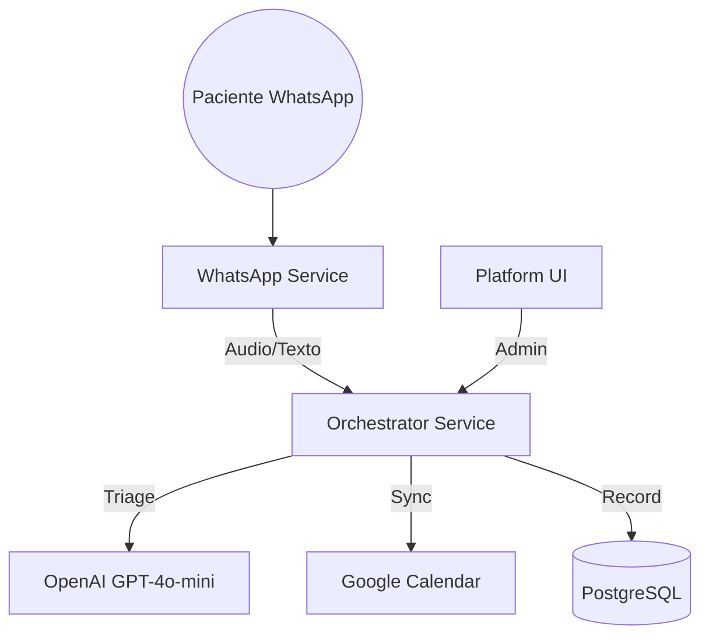

# 🦷 Dentalogic - Plataforma de Gestión Clínica con IA

Sistema de coordinación clínica inteligente, impulsado por IA (**LangChain + OpenAI GPT-4o-mini**). El sistema actúa como un coordinador clínico que gestiona turnos, realiza triajes de urgencias y mantiene historias clínicas digitales multi-tenant.

## 🚀 Guía Rápida de Inicio

### 1. Configuración Inicial
```bash
# Sincronizar entorno dental
cp dental.env.example .env

# Completar las variables (Ver docs/02_environment_variables.md):
# - OPENAI_API_KEY
# - YCLOUD_API_KEY / YCLOUD_WEBHOOK_SECRET  
# - POSTGRES_DSN / REDIS_URL
# - CLINIC_NAME, BOT_PHONE_NUMBER
# - GOOGLE_CALENDAR_ID (Opcional)
```

### 2. Levantar la Infraestructura
```bash
docker-compose up --build
```

### 3. Acceder a los Servicios
| Servicio | URL | Función |
| :--- | :--- | :--- |
| **Orchestrator** | `http://localhost:8000` | Coordinador Clínico (FastAPI + LangChain) |
| **WhatsApp Service** | `http://localhost:8002` | Relay de Mensajería y Whisper |
| **Operations Center** | `http://localhost:5173` | Centro de Operaciones Dental (React) |

---

### 📚 Documentación Completa

### ⚙️ [01. Arquitectura de Microservicios](docs/01_architecture.md)
- Estructura de servicios (Backend, Frontend, Database)
- **Smart Availability:** Lógica JIT y limpieza de nombres.

### 🔑 [02. Variables de Entorno](docs/02_environment_variables.md)
- Credenciales de Google Calendar, OpenAI y YCloud.

### ☁️ [03. Guía de Despliegue](docs/03_deployment_guide.md)
- Instrucciones EasyPanel y configuración de Service Accounts.

### 🧠 [04. Lógica del Agente Dental](docs/04_agent_logic_and_persona.md)
- Persona: Asistente Clínico Profesional.
- Tools: `check_availability`, `book_appointment`, `triage_urgency`.

### 🔀 [13. Flujo Lead -> Paciente](docs/13_lead_patient_workflow.md)
- Protocolo de conversión de contactos nuevos a pacientes activos.

### 🔌 [API Reference](docs/API_REFERENCE.md)
- Endpoints administrativos: Tratamientos, Pacientes, Profesionales.

### 📊 [11. Análisis de Gaps](docs/11_gap_analysis_nexus_to_dental.md)
- Estado actual de la implementación vs requerimientos finales.

---

## 🏗️ Tecnologías Core

| Componente | Tecnología |
| :--- | :--- |
| **Backend** | FastAPI + Python 3.11+ |
| **IA / LLM** | LangChain + GPT-4o-mini + Whisper |
| **Persistencia** | PostgreSQL (Historias Clínicas) |
| **Caché / Locks** | Redis (Deduplicación / Contexto) |
| **Frontend** | React + Tailwind CSS |
| **Infraestructura** | Docker + EasyPanel |

---

## 🎯 Arquitectura Clínica



---

## ⚡ Características Principales

✅ **Coordinador Clínico:** Gestión automatizada de turnos vía WhatsApp.  
✅ **Smart Availability:** Sincronización JIT con Google Calendar y limpieza de nombres.  
✅ **Gestión de Tratamientos:** CRUD administrativo completo con precios y duraciones dinámicas.  
✅ **Triaje Inteligente:** Clasificación de urgencias por IA.  
✅ **Historias Clínicas:** Registro automático de evoluciones y anamnesis.  
✅ **Transcripción Whisper:** Soporte completo para síntomas enviados por audio.  
✅ **Lockout de 24h:** Silencio automático ante intervención humana.

---

*Sistema Dentalogic © 2026.*
