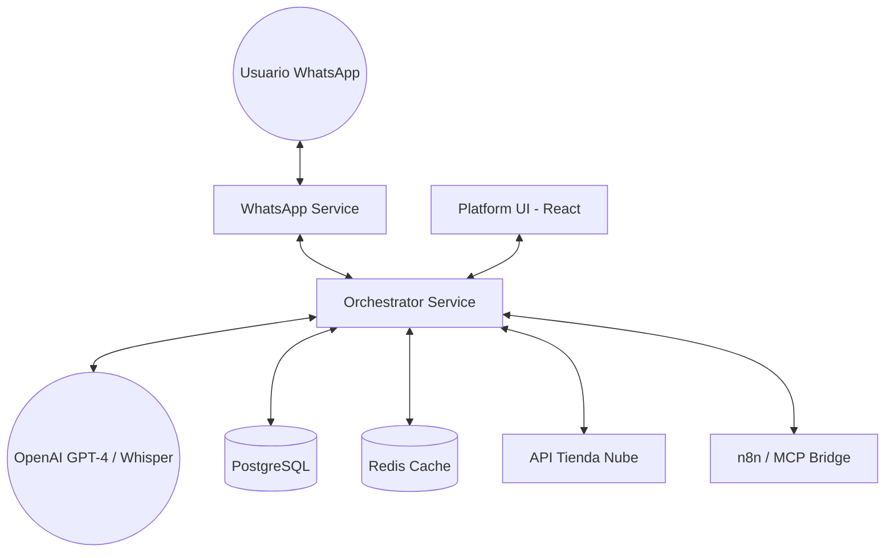

# Arquitectura del Sistema - Pointe Coach

Este documento describe la estructura técnica, el flujo de datos y la interacción entre los componentes del proyecto.

## 1. Diagrama de Bloques (Conceptual)

## 2. Microservicios

El sistema está diseñado para ser modular, aunque en la versión actual (**Nexus v3**), el Orchestrator ha absorbido gran parte de la lógica de herramientas para mejorar la velocidad.

### A. WhatsApp Service (Puerto 8002)
- **Tecnología:** FastAPI + httpx.
- **Función:** Puerta de enlace con la API de **YCloud**.
- **Puntos Clave:**
  - **Deduplicación/Buffering:** Agrupa mensajes del usuario que llegan con pocos segundos de diferencia para enviar una sola respuesta coherente.
  - **Transcripción:** Cuando recibe un audio, utiliza el microservicio de Whisper (vía OpenAI) para enviarle el texto al Orchestrator.
  - **Firma Webhook:** Valida la seguridad de los mensajes entrantes.

### B. Orchestrator Service (Puerto 8000)
- **Tecnología:** FastAPI + LangChain + OpenAI.
- **Función:** El "cerebro" del sistema.
- **Puntos Clave:**
  - **Agente LangChain:** Procesa el lenguaje natural, razona y decide qué herramienta (tool) usar.
  - **Lógica Embebida:** A diferencia de versiones anteriores, las consultas al catálogo de Tienda Nube se hacen directamente desde aquí para reducir latencia.
  - **Gestión de Memoria:** Utiliza Redis para el estado efímero del chat y PostgreSQL para el historial persistente.
  - **Lockout (Bloqueo):** Implementa un mecanismo de silencio de 24 horas (`human_override_until`) cuando un humano interviene en la conversación.

### C. Platform UI (Puerto 80)
- **Tecnología:** React (Vite) + Tailwind.
- **Función:** Panel administrativo para control de conversaciones y configuración.
- **Puntos Clave:**
  - Visualización de chats en tiempo real.
  - Configuración de variables de marca (Nombre, Ubicación, Website).
  - Gestión de credenciales.

### D. Tienda Nube Service (Puerto 8001) - *Legacy/Auxiliar*
- Aunque el código existe, la mayor parte de la interacción directa con productos se movió al Orchestrator para optimizar el rendimiento. Se mantiene para compatibilidad o extensiones futuras de backend.

## 3. Flujo de un Mensaje

1. **Recepción:** El usuario envía un audio o texto a WhatsApp.
2. **Pre-procesamiento:** El `whatsapp_service` recibe el webhook, lo transcribe si es audio, y espera 2 segundos por si el usuario manda más mensajes (agrupación).
3. **Orquestación:** Se envía el paquete de texto al `/chat` del Orchestrator.
4. **Razonamiento:** El Orchestrator carga el historial de los últimos 20 mensajes de la DB, inicia el agente de IA con su **Persona (Argentina Buena Onda)** y las reglas de negocio.
5. **Ejecución de Tools:** Si el usuario pregunta por un producto, el agente llama a `search_specific_products`, que consulta la API de Tienda Nube y devuelve los datos simplificados.
6. **Respuesta:** La IA genera un JSON estructurado con texto e imágenes.
7. **Entrega:** El `whatsapp_service` recibe el JSON y envía las burbujas de mensaje correspondientes al usuario.

## 4. Tecnologías Core

| Tecnología | Uso |
| :--- | :--- |
| **FastAPI** | Framework para todos los backend. |
| **LangChain** | Framework para la orquestación de LLMs y Tools. |
| **PostgreSQL** | Base de datos persistente (Chats, Tenants, Logs). |
| **Redis** | Caché de herramientas y control de concurrencia. |
| **n8n / MCP** | Bridge para herramientas externas (Cupones, Mails). |
| **YCloud** | Proveedor de API de WhatsApp Business. |
